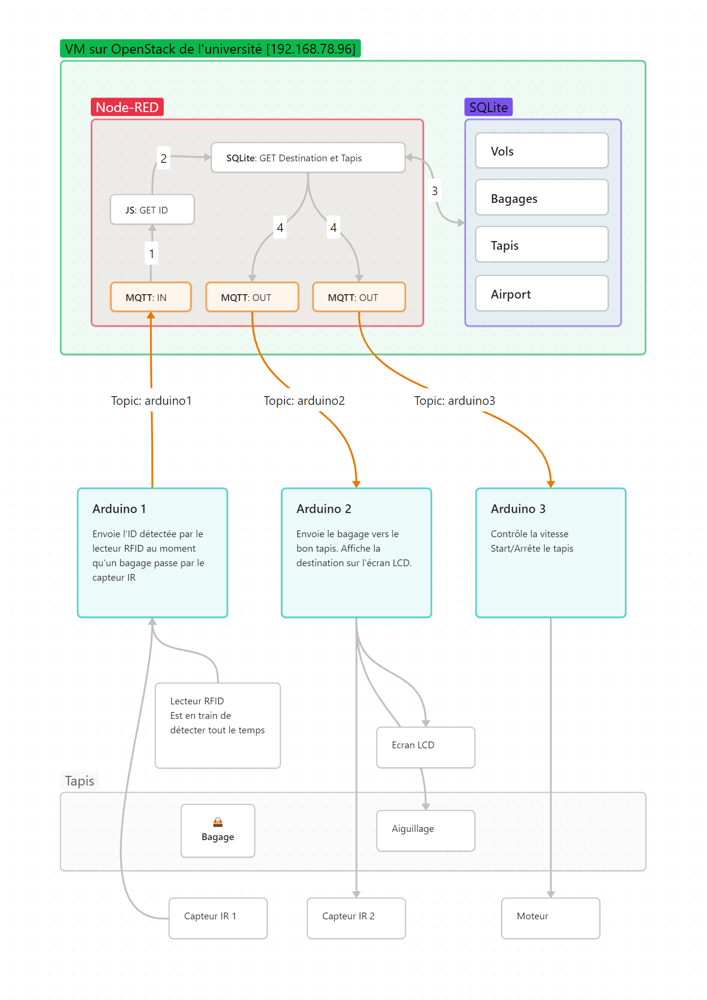
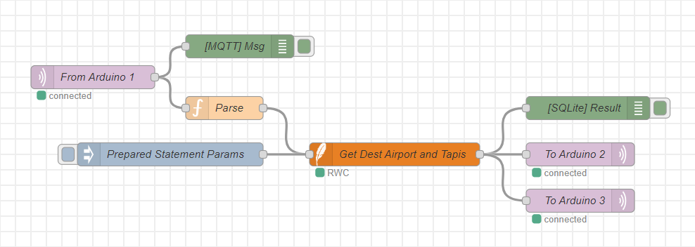
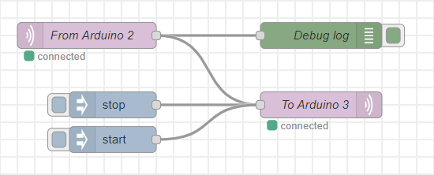
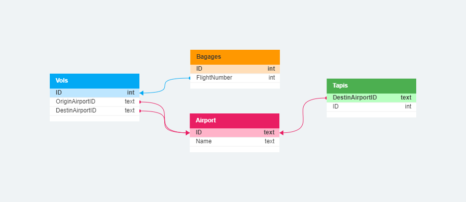

# TIW IoT 2022-2023

- Eldar Kasmamytov
- Ibrahim Ucar
- Leatitia Castaldo
- Jessim Nekka

## Architecture



## Node-RED

Nous avons **4 topics MQTT**.  

Les 3 premiers **arduino1**, **arduino2**, **arduino3** correspondent à leurs descriptions sur la [diagramme](./assets/iot-architecture.png) d'architecture ci-dessus.  



Le quatrième topic **arduino4** est utilisé pour pouvoir contrôler le moteur, notamment l'Arduino 2 envoie un message à l'Arduino 3 pour qu'elle arrête le tapis roulant.  



## Base de données

Nous utilisons une base de données SQLite. La structure de la BD ci-dessous.



## Commandes utiles

### SQLite

Launch SQLite prompt :  
```bash
sudo docker run --rm -it \
  -v "/opt/sqlite:/workspace" \
  -w /workspace \
  keinos/sqlite3 \
  sqlite3 /workspace/iot/iot.db
```

Create tables :  
```sql
DROP TABLE IF EXISTS Airport;
CREATE TABLE Airport (
    ID TEXT PRIMARY KEY,
    Name TEXT
);

DROP TABLE IF EXISTS Vols;
CREATE TABLE Vols (
    ID INTEGER PRIMARY KEY,
    OriginAirportID TEXT,
    DestinAirportID TEXT,
    FOREIGN KEY (OriginAirportID) REFERENCES Airport(ID),
    FOREIGN KEY (DestinAirportID) REFERENCES Airport(ID),
    CONSTRAINT CheckOriginNotEqualDestin CHECK (OriginAirportID <> DestinAirportID)
);

DROP TABLE IF EXISTS Bagages;
CREATE TABLE Bagages (
    ID INTEGER PRIMARY KEY,
    FlightNumber INTEGER,
    FOREIGN KEY (FlightNumber) REFERENCES Vols(ID)
);

DROP TABLE IF EXISTS Tapis;
CREATE TABLE Tapis (
    DestinAirportID TEXT PRIMARY KEY,
    ID INTEGER,
    FOREIGN KEY (DestinAirportID) REFERENCES Airport(ID),
    CONSTRAINT CheckTapisId CHECK (ID BETWEEN 1 AND 3)
);
```

Insert test data :  
```sql
INSERT INTO Airport (ID, Name)
VALUES ('AP1', 'Airport 1'),
       ('AP2', 'Airport 2');

INSERT INTO Vols (ID, OriginAirportID, DestinAirportID)
VALUES (1, 'AP1', 'AP2'),
       (2, 'AP2', 'AP3'),
       (3, 'AP3', 'AP1');

INSERT INTO Bagages (ID, FlightNumber)
VALUES (1, 1),
       (2, 2),
       (3, 3),
       (243, 3);

INSERT INTO Tapis (DestinAirportID, ID)
VALUES ('AP1', 1),
       ('AP2', 2),
       ('AP3', 3);
```

### Node-RED

Start node-red instance :  
```bash
sudo docker run -d -it \
  -p 80:1880 \
  -v node_red_data:/data \
  -v /opt/sqlite:/sqlite \
  --name mynodered \
  nodered/node-red
```

Get Destination Airport name and Tapis ID :  
```sql
SELECT a.Name as AirportName, t.ID as Tapis
FROM Airport a INNER JOIN Tapis t ON a.ID=t.DestinAirportID
WHERE a.ID=(
    SELECT DestinAirportID FROM Vols v WHERE v.ID=(
        SELECT FlightNumber FROM Bagages WHERE ID=$bID
    )
);
```

## InfraRouge sur aduino RFID

Comme on vous l'a dit lors de la présentation, nous avions du mal à faire fonctionner le code pour l'infrarouge et le capteur RFID en même temps.
Cependant, le code JavaScript pour le capteur infrarouge est présent dans le projet [ICI](./arduino_RFID/ledIR.js).
Je vous met également le code chargé sur l'arduino [ICI](./arduino_RFID/ledIR.ino). 

Je vous mets, comme convenu, le lien vers une vidéo de test du code (j'ai enlevé le shield RFID pour la demo) : https://www.youtube.com/shorts/DIQOCmjskxQ

## Partie Ethique

Ce rapport met en évidence les considérations éthiques à prendre en compte pour la mise en production effective de notre projet. Bien que ces considérations n'aient pas encore été intégrées à ce stade, nous reconnaissons leur importance capitale.

Tout d'abord, il est primordial de respecter l'autonomie humaine lors du développement et de l'implémentation de notre système. Nous devons établir des mécanismes clairs de vérification et de gouvernance pour permettre une supervision et une contestation des décisions prises par le système par une autorité humaine. En particulier, il est essentiel de permettre une intervention directe dans les situations critiques, telles qu'un manque d'informations sur l'origine ou la destination d'un bagage.

Ensuite, nous sommes pleinement conscients de valoriser la robustesse technique et de la fiabilité de notre système. Il est crucial de mettre en place des mesures de sécurité adéquates afin de prévenir toute tentative d'interférence ou de détournement des bagages. Des tests approfondis seront nécessaires pour garantir la précision et la fiabilité du système. Nous devons également élaborer des plans de secours et des protocoles de sécurité pour minimiser les perturbations et faire face aux éventuelles défaillances.

La protection de la vie privée est une autre considération éthique essentielle. Nous devons limiter la collecte et le traitement des données aux informations strictement nécessaires pour le bon fonctionnement du système. Il est primordial de restreindre l'accès aux données et de respecter les réglementations en vigueur en matière de protection des données. Nous devons également mettre en place des politiques de confidentialité transparentes afin d'informer les utilisateurs sur les pratiques de collecte et d'utilisation des données.

Enfin, il faut s'assurer du bien-être environnemental et sociétal. Nous nous engageons à utiliser des technologies et des pratiques visant à réduire la consommation énergétique de notre système. En favorisant des solutions respectueuses de l'environnement, nous souhaitons contribuer à un développement durable et responsable.

En conclusion, bien que nous n'ayons pas encore intégré ces considérations éthiques dans notre projet d'aiguilleur de bagages, nous en avons pleinement conscience et les considérons comme essentielles pour une mise en œuvre à grande échelle. Nous sommes résolus à garantir un système éthique qui respecte l'autonomie humaine, qui est techniquement robuste, respectueux de la vie privée, transparent, respectueux de l'environnement et socialement responsable.
