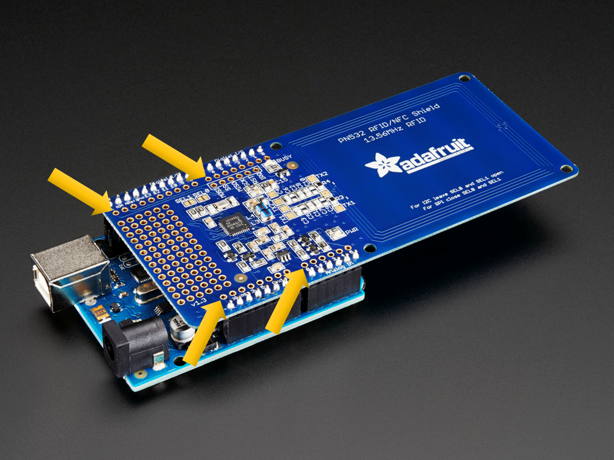

# TP Objets connectés

Dans ce TP, vous allez mettre en place une grande partie du montage qui vous servira durant le projet. Cela consiste à construire les objets connectés que vous allez utiliser (microcontrôleurs, capteurs et actionneurs), et à développer le code qui servira à les piloter.

Comme indiqué dans le [pitch du projet](../README.md), il y a deux objets distincts, tous deux reliés à des PC par des câbles USB. Les deux objets seront contrôlés en JS côté PC, mais avec des technos différentes.

## Détecteur de bagages

&Agrave; l'entrée du tapis roulant se trouve un détecteur de bagages qui permet de les identifier et de déclencher l'envoi d'un message avec l'heure à laquelle les bagages sont passés sous le portique.

### Matériels

- Microcontrôleur arduino UNO
- Breadboard
- Capteur RFID/NFC [Adafruit PN532](https://www.adafruit.com/product/789)
- LED infrarouge [Vishay VSLB3940](https://fr.rs-online.com/web/p/leds-infrarouges/1452586)
- Récepteur infrarouge [Vishay TSSP4038](https://fr.rs-online.com/web/p/recepteurs-ir/9195848)

### Montage

Le capteur RFID est un "shield" arduino, et se monte de façon très "straightforward". Il faut juste regarder la doc pour savoir quels sont les ports qui sont utilisés et se servir des autres pour le détecteur de passage IR.

Le détecteur de passage est constitué de la LED et du capteur infrarouges (IR). Vous les positionnerez sur le breadboard et les relierez à des ports libres de l'arduino.

Remarques :

- Les PN532 sont livrés sans les prises femelles qui permettent d'en faire de vrais "shields" sur lesquels on peut brancher de nouveaux composants. Il faudra donc arriver à bancher la LED et le capteur IR sur les trous qui permettent de déporter les connexions un peu plus l'intérieur du circuit imprimé (voir photo)
  
- Pour des raisons administratives, la dernière commande de LEDs + capteurs n'est pas encore arrivée. Certains groupes commenceront donc le TP avec des LEDs blanches et des capteurs de luminosité...

**Rappel : n'oubliez pas de débrancher le câble USB avant toute modification du montage !**

### Code arduino

#### Premier contact avec l'arduino UNO

Si vous n'avez jamais programmé sur arduino avant, la première chose à faire quand vous avez installé l'[IDE arduino](https://www.arduino.cc/en/software) est de faire clignoter la "LED builtin". Un programme (sketch) vous est fourni pour cela dans le menu File -> Examples -> 01.Basics -> Blink. Assurez-vous que l'arduino est branché et reconnu par votre PC, et téléversez le code sur l'arduino.

#### Téléchargement et utilisation de la bibliothèque du capteur RFID

L'IDE comporte un _Library manager_ auquel vous pouvez accéder soit en cliquant sur les livres à gauche, soit par le menu Sketch -> Include Library. Installez la bibliothèque _Adafruit PN532_, avec sa dépendance (_Adafruit BusIO_).

**Quelques infos sur le codage RFID :** le capteur fonctionne pour les antennes RFID "simples" (passives), mais aussi en NFC. Vous pouvez donc le tester avec votre badge de l'université, votre téléphone... Le codage des ID détectés peut être en 4, 7 ou 10 bits, selon la norme de [MIFARE](https://fr.wikipedia.org/wiki/Mifare), qui permet d'accéder à un numéro de série (en clair) et à un identifiant (chiffré). Il faut une clé pour déchiffrer cet identifiant. Les cartes qui vous sont fournies ont une clé par défaut indiquée dans le sketch.

Une fois cette bibliothèque installée, vous avez accès, dans les exemples de code, à un sketch _readMiFare_ qui vous permet de lire l'ID d'une carte et de l'envoyer sur le port série (USB). Grâce au moniteur série (menu Tools -> Serial Monitor), vous pouvez observer ce qui passe par le câble USB. Téléverez cet exemple, et vérifiez-en le fonctionnement.

### Code JS

Dans cette partie, vous allez réaliser un programme qui reçoit des données sur le port USB et les "pousse" vers une file de messages en utilisant le protocole MQTT. Accessoirement, nous vous fournissons aussi un code qui permet de vérifier que les messages sont bien arrivés sur le broker.

Commencez par initialiser un projet NodeJS.

Dans ce projet, ajoutez deux bibliothèques :
- [SerialPort](https://www.npmjs.com/package/serialport) qui vous permettra de "parler" à l'arduino
- [MQTT](https://www.npmjs.com/package/mqtt) qui vous permettra d'échanger des messages avec le broker MQTT installé sur votre VM.

Inspirez-vous du code fourni pour réaliser chaque partie (réception USB, émission de message, souscription/vérification).

To Be Continued...
